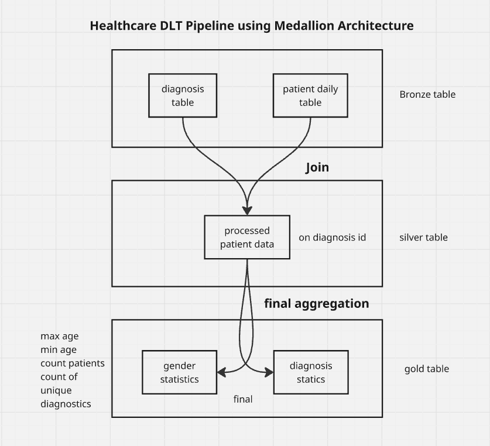

# Healthcare DLT Pipeline with Medallion Architecture

## Project Overview
This project implements a **Healthcare Data Pipeline** using **Databricks, PySpark, Delta Lake, and Delta Live Tables (DLT)**. The pipeline is designed to process raw healthcare data in a **Medallion Architecture** model, with **Bronze, Silver, and Gold layers**, ensuring data quality, reliability, and analytics readiness.

---

## Components

### 1. **Bronze Layer**
- **Purpose**: Raw ingestion layer for healthcare data (e.g., patient records, lab results).  
- **Why**: Stores immutable raw data, capturing all incoming events and source information.  
- **Implementation**: Delta tables in Databricks using PySpark streaming or batch ingestion.

### 2. **Silver Layer**
- **Purpose**: Cleansed and transformed layer for analytical processing.  
- **Why**: Applies schema enforcement, filtering, deduplication, and data validation.  
- **Implementation**: Delta Live Tables pipelines transform Bronze data into structured, standardized tables.

### 3. **Gold Layer**
- **Purpose**: Aggregated and curated data ready for reporting, ML models, or dashboards.  
- **Why**: Provides high-value insights to stakeholders with high performance and low latency.  
- **Implementation**: DLT pipelines aggregate Silver tables into KPIs, metrics, or patient summaries.

### 4. **Databricks Delta Live Tables (DLT)**
- **Purpose**: Orchestrates ETL/ELT pipelines with automated quality checks and lineage tracking.  
- **Why**: Reduces operational overhead while ensuring reliability, monitoring, and reproducibility.  
- **Features**:
  - Automatic schema validation
  - Data quality enforcement
  - Incremental updates with efficient Delta Lake storage  

### 5. **Delta Lake**
- **Purpose**: Provides ACID-compliant storage for all Medallion layers.  
- **Why**: Ensures consistency, supports time travel, and allows incremental processing efficiently.

---

## Tech Stack
- **Data Processing & ETL**: PySpark, Delta Live Tables (DLT)  
- **Storage & Lakehouse**: Delta Lake on Databricks  
- **Orchestration & Workflow**: Databricks DLT Pipelines  
- **Analytics**: Ready-to-query Gold tables for ML or BI  

---

## GitHub Repo Structure

